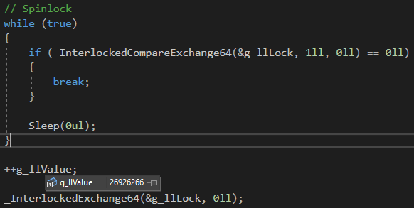
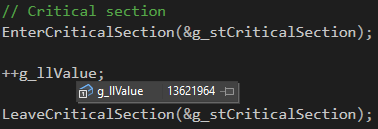
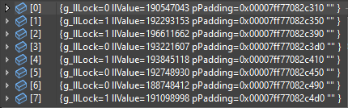
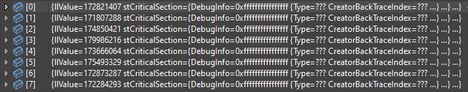

# Test-Spinlock_vs_CriticalSection

## Objective

1. Which one will have lower overhead?

2. Which one will have greater number of access to a shared resource when multiple threads try to acquire lock / enter critical section?

3. Which one will have greater number of access to each thread resource when multiple threads try to acquire lock / enter critical section?
* thread resource : shared memory allocated per thread which is not local

4. Does thread waiting for ownership of the critical section during EnterCriticalSection prevents thread from cpu time slice?

## Result

### 8 threads spinning to acquire lock and shared resource access count for 3 seconds

### 8 threads spinning entering critical section and shared resource access count for 3 seconds

### 8 threads spinning to acquire lock and shared resource per thread access count for 3 seconds

### 8 threads spinning entering critical section and shared resource per thread access count for 3 seconds

## Conclusion

1. Which one will have lower overhead?
- Spinlock using interlock

2. Which one will have greater number of access to a shared resource when multiple threads try to acquire lock / enter critical section?
- Spinlock using interlock ( Access count of interlock : 26926266 / Access count of critical section : 13621964 )

3. Which one will have greater number of access to each thread resource when multiple threads try to acquire lock / enter critical section?
* thread resource : shared memory allocated per thread which is not local
- Spinlock using interlock ( Average access count of interlock : 192389365 / Average access count of critical section : 174222788 )

4. Does thread waiting for ownership of the critical section during EnterCriticalSection prevents thread from cpu time slice?
